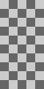
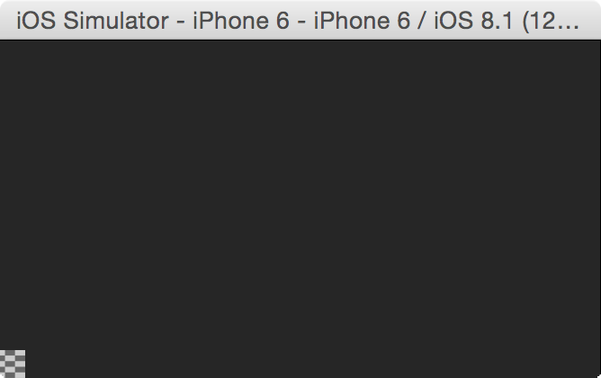
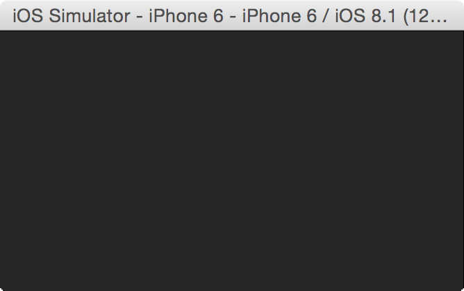
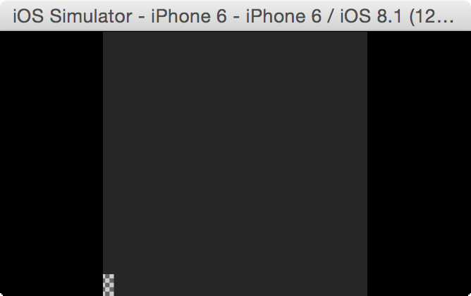
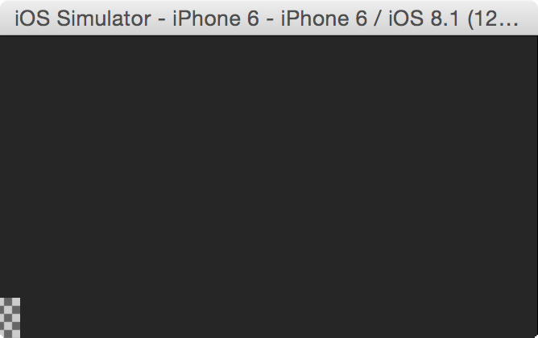

# SKScene.scaleMode

The four possible `SKScaleMode` settings.



## Default setting

```Swift
let scene = SKScene(size: CGSize(x: 736, y: 414))
scene.scaleMode = .Fill
```



### Other settings

```Swift
let scene = SKScene(size: CGSize(x: 736, y: 414))
scene.scaleMode = .AspectFill
```



```Swift
let scene = SKScene(size: CGSize(x: 736, y: 414))
scene.scaleMode = .AspectFit
```




```Swift
let scene = SKScene(size: CGSize(x: 736, y: 414))
scene.scaleMode = .ResizeFill
```

