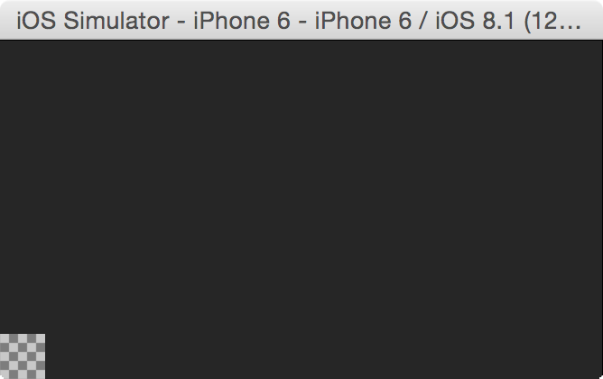
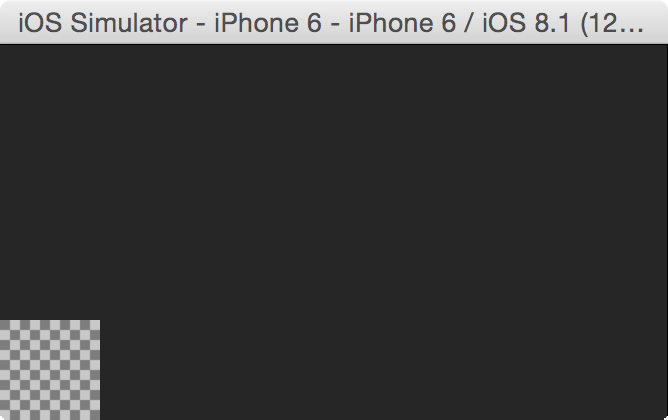
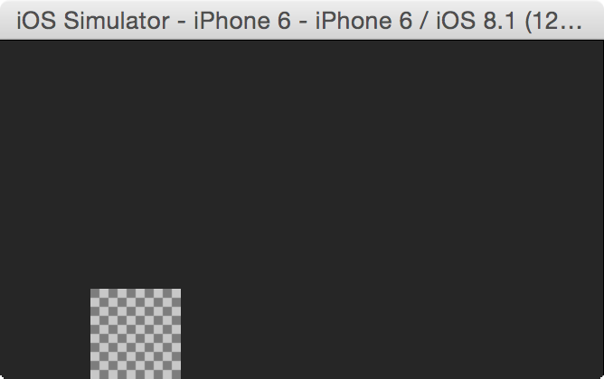
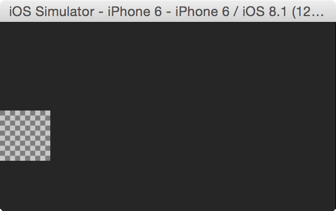

# SKSpriteNode

This descendant of `SKNode` draws an image.

## Initialisers

```Swift
convenience init(imageNamed name: String)
```

This initialiser takes an image by name from the `Images.xcassets` collection and displays it. For example this image, called `square.png`.


### Default

```Swift
let spriteNode = SKSpriteNode(imageNamed: "square.png")
```



```Swift
(0.0,0.0)                   // spriteNode.position
(0.5,0.5)                   // spriteNode.anchorPoint
(-50.0,-50.0,100.0,100.0)   // spriteNode.frame
```

This positions the node to the bottom left - `(0.0, 0.0)`. Then shifts it so that the center of the node would be at the point `(0.0, 0.0)`.

#### Configuring the position using `anchorPoint`

```Swift
let spriteNode = SKSpriteNode(imageNamed: "square.png")
spriteNode.anchorPoint = CGPoint(x: 0, y: 0)
```



```Swift
(0.0,0.0)                   // spriteNode.position
(0.0,0.0)                   // spriteNode.anchorPoint
(0.0,0.0,100.0,100.0)       // spriteNode.frame
```

```Swift
let spriteNode = SKSpriteNode(imageNamed: "square.png")
spriteNode.anchorPoint = CGPoint(x: -1, y: 0)
```



```Swift
(0.0,0.0)                   // spriteNode.position
(-1.0,0.0)                  // spriteNode.anchorPoint
(0.0,0.0,200.0,100.0)       // spriteNode.frame
```

```Swift
let spriteNode = SKSpriteNode(imageNamed: "square.png")
spriteNode.anchorPoint = CGPoint(x: 0, y: -1)
```



```Swift
(0.0,0.0)                   // spriteNode.position
(0.0,-1.0)                  // spriteNode.anchorPoint
(0.0,0.0,100.0,200.0)       // spriteNode.frame
```